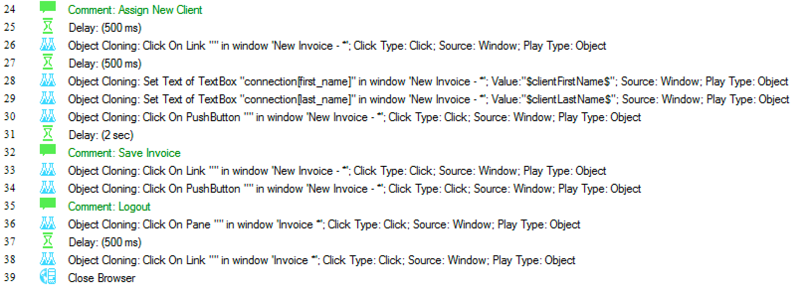

# ODM RPA Invoicing sample

This sample describe how to integrate IBM Operational Decision Manager with IBM RPA.

## Table of Contents

  - [Before you begin](#before-you-begin)
     - [Required software](#required-software)
     - [Create an Invoicely account](#create-an-invoicely-account)
     - [Create a Credential vault in IBM RPA Control Room](#create-a-credential-vault-in-ibm-rpa-control-room)
  - [Scenario](#scenario)
  - [Step 1: Automating invoice creation with IBM RPA](#step-1-automating-invoice-creation-with-ibm-rpa)
     - [Creating the Invoice](#creating-the-invoice)
     - [Main Loop](#main-loop)
  - [Step 2: Full automation with IBM RPA + IBM ODM](#step-2-full-automation-with-ibm-rpa-ibm-odm)

---

## Before you begin

### Required software

Here is the list of software you need to install in order to run the demo:

* [IBM Robotic Process Automation with Automation Anywhere](https://www.ibm.com/cloud-computing/products/digital-process-automation/robotic-process-automation/)
* [IBM Operational Decision Manager](http://www-03.ibm.com/software/products/en/odm)
* [NodeJS](https://nodejs.org/en/download/)

### Create an Invoicely account

Go to  and create an account

### Create a Credential vault in IBM RPA Control Room

* Log in to Control Room
* Go to the *Credential Manager* tab
* Click *Add Credential*
* Name it **Invoicely**
* Add the following attributes, with their corresponding values:
   * **email**: email you used to create your Invoicely account.
   * **password**: password for your account
   * **business**: name of the 'business' entity you created when creating your invoicely account.

## Scenario

Jack is an accountant for Acme Retail, a small retailing company.

Andrea is a reseller for Acme Retail. Each week, she orders a list of goods to Jack, sending him 
<a target="_blank" href="./assets/invoices.csv">a CSV file </a>
listing the quantity and unit price of each item she wants to order.

</img>

Jack uses invoicely.com to register invoices corresponding to Andrea's orders. 

Depending on the quantity and type of goods, he applies a tax rate and a discount to each row in the orders CSV
and save the result in his invoicely account.

</img>

## Step 1: Automating invoice creation with IBM RPA

Our first step consists of recording an Automation Anywhere task that reads the CSV file, and, for each row, connects 
to  and create the corresponding invoice.

Since the tax rate and discounted price are not present in the CSV, we prompt the user during the process in order to get those values.

### Creating the Invoice

The [Create Invoice.atmx](./assets/Create%20Invoice.atmx) task creates an invoice in Invoicely, given
a unit price, a quantity, an order id, an item description, a tax rate, and a client first name and last name.

1. Login, create Invoice, set order ID, description and quantity

    

2. Set tax and unit price

    

3. Set client information, save and logout

    

### Main Loop

The [Main.atmx](./assets/Main.atmx) task does the following:
* Opens orders CSV file
* For each row
   * Prompt the user with the tax rate and discounted price
   
| </img> | </img> |
   
   * Invoke the invoice creation task.

## Step 2: Full automation with IBM RPA + IBM ODM

Automation would be complete if we can avoid prompting the user with the tax rate and discounted price.
This is where IBM ODM will come handy!

# Issues and contributions
For issues relating to this demo, please use the [GitHub issue tracker](../../issues).
We welcome contributions following [our guidelines](CONTRIBUTING.md).

# License
The source files found in this project are licensed under the [Apache License 2.0](LICENSE).

# Notice
© Copyright IBM Corporation 2017.

