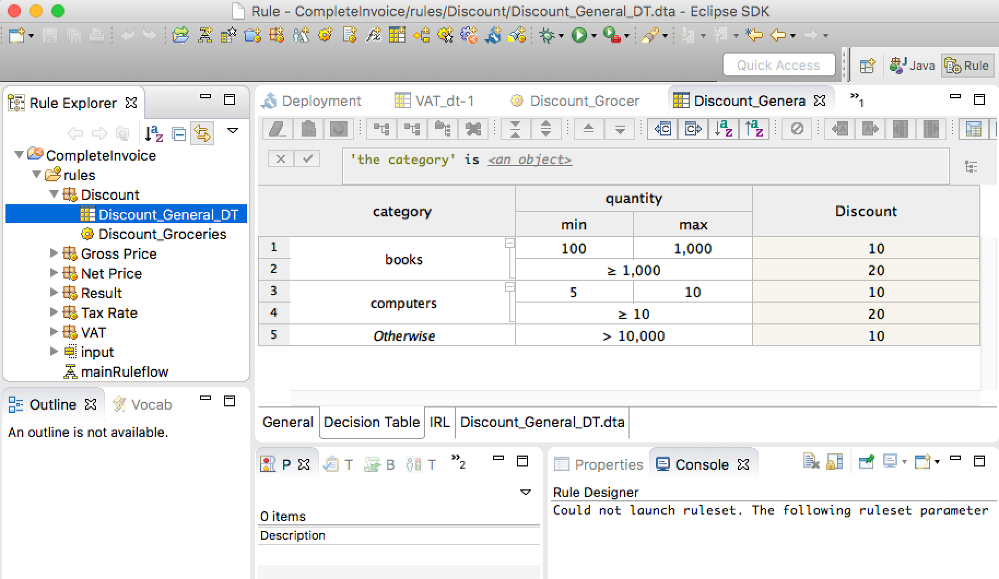
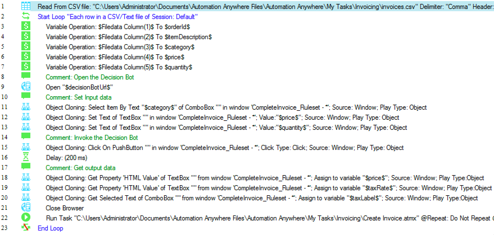

# ODM RPA Invoicing sample

This sample describe how to integrate IBM Operational Decision Manager with IBM RPA.

## Table of Contents

  - [Before you begin](#before-you-begin)
     - [Required software](#required-software)
     - [Create an Invoicely account](#create-an-invoicely-account)
     - [Create a Credential vault in IBM RPA Control Room](#create-a-credential-vault-in-ibm-rpa-control-room)
  - [Scenario](#scenario)
  - [Step 1: Automating invoice creation with IBM RPA](#step-1-automating-invoice-creation-with-ibm-rpa)
     - [Creating the Invoice](#creating-the-invoice)
     - [Main Loop](#main-loop)
  - [Step 2: Full automation with IBM RPA + IBM ODM](#step-2-full-automation-with-ibm-rpa-ibm-odm)
     - [Create and deploy a Decision Service](#create-and-deploy-a-decision-service)
     - [Deploying a Decision bot](#deploying-a-decision-bot)
     - [Invoke the Decision Bot from RPA](#invoke-the-decision-bot-from-rpa)

---

## Before you begin

### Required software

Here are the software you need to install in order to run the demo:

* [IBM Robotic Process Automation with Automation Anywhere](https://www.ibm.com/cloud-computing/products/digital-process-automation/robotic-process-automation/)
* [IBM Operational Decision Manager](http://www-03.ibm.com/software/products/en/odm)
* [NodeJS](https://nodejs.org/en/download/)
* [ODM Decision Forms](https://www.npmjs.com/package/odm-decision-forms) Github contrib

### Create an Invoicely account

Go to [invoicely.com](https://invoicely.com) and create an account

### Create a Credential vault in IBM RPA Control Room

* Log in to Control Room
* Go to the *Credential Manager* tab
* Click *Add Credential*
* Name it **invoicing**
* Add the following attributes, with their corresponding values:
   * **email**: email you used to create your Invoicely account.
   * **password**: password for your account

## Scenario

Jack is an accountant for Acme Retail, a small retailing company.

Andrea is a reseller for Acme Retail. Each week, she orders a list of goods to Jack, sending him 
<a target="_blank" href="./assets/invoices.csv">a CSV file </a>
listing the quantity and unit price of each item she wants to order.

</img>

Jack uses [invoicely.com](invoicely.com) to register invoices corresponding to Andrea's orders. 

Depending on the quantity and type of goods, he applies a tax rate and a discount to each row in the orders CSV
and save the result in his invoicely account.

</img>

## Step 1: Automating invoice creation with IBM RPA

Our first step consists of recording an Automation Anywhere task that reads the CSV file, and, for each row, connects 
to [](http://invoicely.com) and create the corresponding invoice.

Since the tax rate and discounted price are not present in the CSV, we prompt the user during the process in order to get those values.

### Creating the Invoice

The [Create Invoice.atmx](./assets/Create%20Invoice.atmx) task creates an invoice in Invoicely, given
a unit price, a quantity, an order id, an item description, a tax rate, and a client first name and last name.

1. Login, create Invoice, set order ID, description and quantity

    

2. Set tax and unit price

    

3. Set client information, save and logout

    

### Main Loop

The [Main.atmx](./assets/Main.atmx) task does the following:
* Opens orders CSV file
* For each row
   * Prompt the user with the tax rate and discounted price
   
        </img> </img>
   
   * Invoke the invoice creation task.

Here is the complete task:


## Step 2: Full automation with IBM RPA + IBM ODM

Automation would be complete if we can avoid prompting the user with the tax rate and discounted price.
This is where IBM ODM will come handy.

### Create and deploy a Decision Service

In ODM, we create a [Decision Service](./assets/CompleteInvoice.zip) that takes a category, price and quantity as input, 
and returns a discounted unit price and a tax rate and label.



This Decision Service is made of:

   * A decision table that determines a VAT from the product category
   
   </img>

   * A decision table that determines a discount from the product quantity and category
   
   </img>
   
   * A specific rule that sets a discount when the product category is 'grocery'

   </img>

Once you have downloaded the [decision service](./assets/CompleteInvoice.zip), open it in ODM Rule Designer, and deploy 
it to your local Rule Execution Server.

### Deploying a Decision bot

A Decision bot is an auto-generated form allowing to execute a Decision Service. Once this form is 
generated, we will write an IBM RPA task to invoke it and get the tax and discounted price for each 
order.

You now need to install and run the odm-decision-forms contrib, which will provide you with a 
generated form to invoke the decision service.

```bash
npm install -g odm-decision-forms
odm-decision-forms --decision http://localhost:9090/DecisionService --console http://localhost:9090/res
```

*Note:* we assume that your ODM server is running at http://localhost:9090. You can change it to fit your installation.

Then open the following URL: [http://0.0.0.0:3000/ruleapp/CompleteInvoice_Ruleapp/CompleteInvoice_Ruleset](http://0.0.0.0:3000/ruleapp/CompleteInvoice_Ruleapp/CompleteInvoice_Ruleset)

Test the bot by entering some input values and hit 'Run Decision'.
You should get the following result:


### Invoke the Decision Bot from RPA

We can now amend our [main loop](./assets/Main%20with%20ODM.atmx). 

Instead of prompting the user, we use standard RPA object cloning to invoke our decision bot, passing the quantity, unit 
price and category of each order,  and getting a tax rate, tax label, and discounted price.



# Issues and contributions
For issues relating to this demo, please use the [GitHub issue tracker](../../issues).
We welcome contributions following [our guidelines](CONTRIBUTING.md).

# License
The source files found in this project are licensed under the [Apache License 2.0](LICENSE).

# Notice
© Copyright IBM Corporation 2017.

